# [Ollama](https://ollama.com/)
- Ollama는 사용자가 자신의 PC에서 대규모 언어 모델(LLM)을 직접 실행할 수 있도록 도와주는 오픈소스 플랫폼입니다. 
- 다양한 오픈 소스 LLM 모델의 설치, 실행, 커스터마이즈 기능까지 간편하게 제공하기 때문에 오픈 소스 AI 기술을 활용하고자 하는 사용자들에게 최적의 솔루션을 제공합니다.

---
## Ollama 장점 
- Ollama의 가장 큰 강점은 로컬 환경에서의 모델 구동에 있습니다. 이는 다음과 같은 세 가지 핵심적인 이점을 제공합니다:
  - `데이터 프라이버시`: 모델과의 대화 내용이 사용자의 기기에 안전하게 보관됩니다
  - `비용 효율성`: 클라우드 서비스와 달리 사용량에 따른 추가 비용이 발생하지 않습니다
  - `오프라인 접근성`: 인터넷 연결 없이도 자유롭게 모델을 활용할 수 있습니다

---
## [Ollama 모델](https://ollama.com/search)
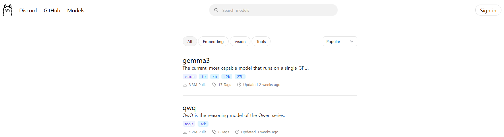

---
## [Ollama 설치](https://ollama.com/download/windows)
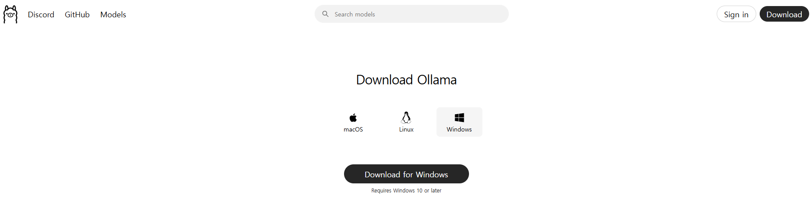

---
## [Ollam 사용법](https://marcus-story.tistory.com/22)
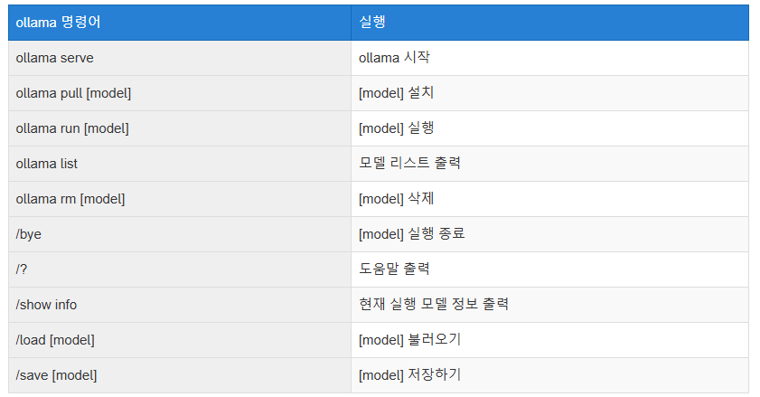

---
### [단계1: 모델 다운로드 및 실행](https://github.com/ollama/ollama?tab=readme-ov-file#model-library)  

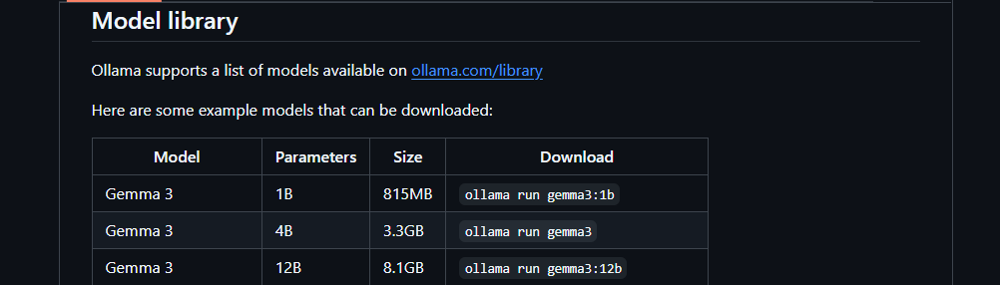

---
```shell
ollama run <모델명>:<테그>
```
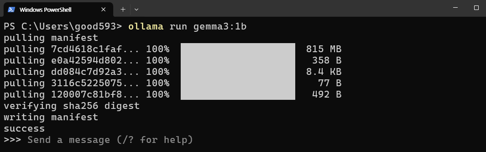

---
### 단계2: 모델 대화 종료 
```shell
/bye
```
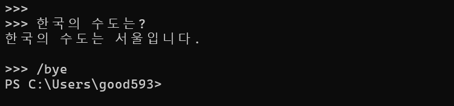

---
### 단계3: 다운로드된 모델 조회 
```shell
ollama list
```
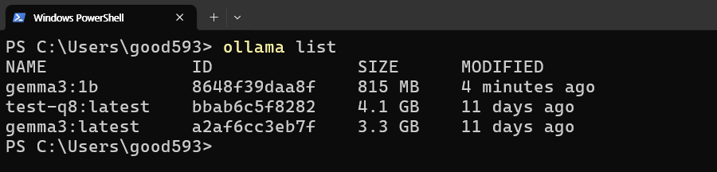

---
## [Ollama with Huggingface](https://huggingface.co/docs/hub/ollama)
```shell
ollama run hf.co/{username}/{repository}:{quantization}
```
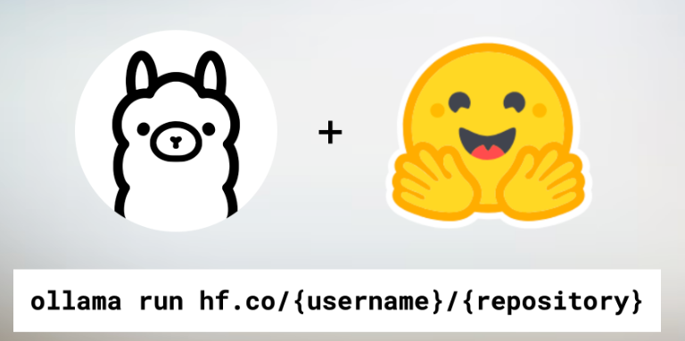

---


---
### 단계1: huggingface에서 gguf 모델 선택 
- `unsloth/gemma-3-1b-it-GGUF`

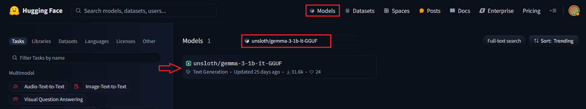

---
### 단계2: ollama 선택
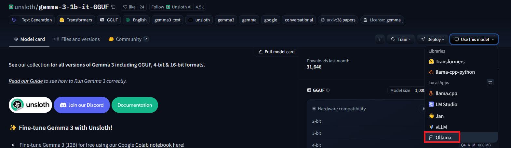

---
### 단계3: 명령어 Copy
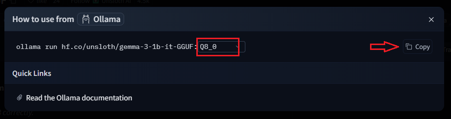

---
### 단계4: ollama에 다운로드 
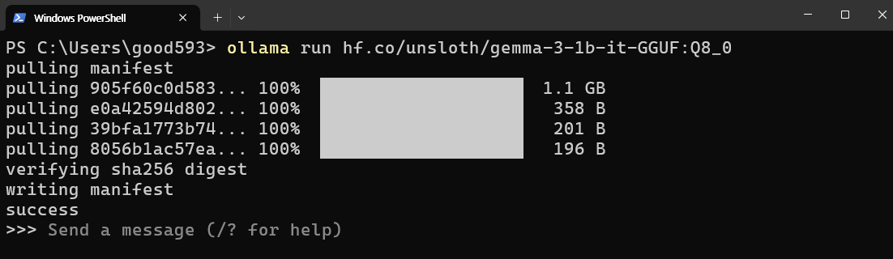 


