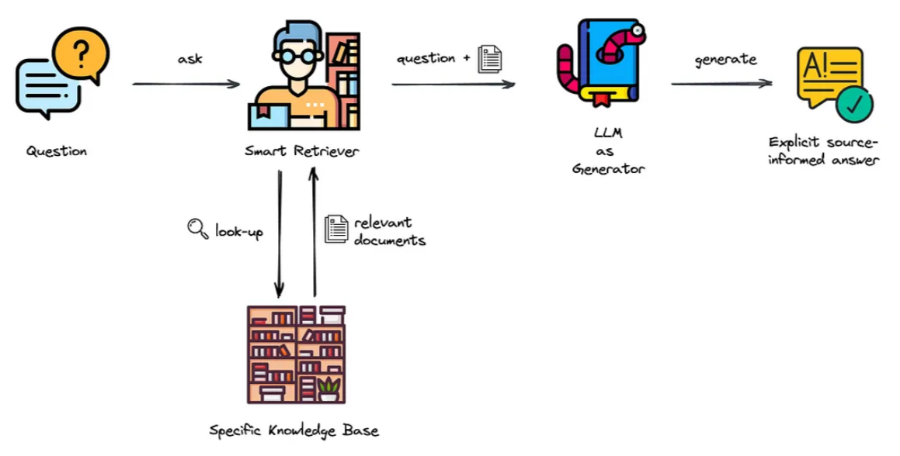
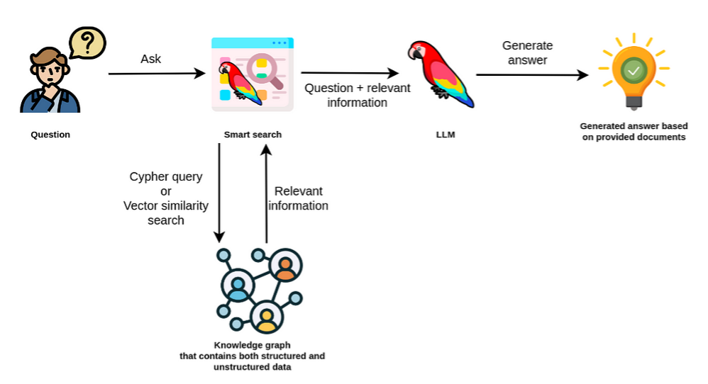

# 1. RAG (Retrieval-Augmented Generation)
- LLM이 자체적으로 알지 못하는 정보는 **외부 지식 저장소(예: 문서, DB)** 에서 **검색(Retrieval)** 하여, 그 결과를 바탕으로 텍스트를 **생성(Generation)** 하는 방식입니다.

---

---
### 구성 요소
1. `Retriever`: 사용자 질문과 유사한 문서를 벡터 검색으로 찾음
2. `Generator (LLM)`: 검색된 문서를 참고하여 응답 생성

### 예시
- 질문: “카프카는 어떤 시스템인가요?”
- → 관련 문서를 벡터 DB에서 검색
- → LLM이 검색된 내용을 기반으로 설명 생성

---
### 장점
- 최신 정보 반영 가능
- 기존 LLM의 한계(지식 cutoff)를 극복

### 단점
- 문서 간 연결성 없음 (정보가 흩어져 있을 경우 한계)
- 검색된 문서가 적절하지 않으면 부정확한 답 생성 가능

---
# 2. GraphRAG (Graph-enhanced RAG)
- 일반 RAG의 검색 한계를 극복하기 위해 문서 내 개념/엔티티 간의 관계를 그래프로 모델링하고, 이 그래프 기반으로 문맥적, 구조적으로 연관된 정보를 추론 및 검색하여 생성에 활용하는 방식입니다.

---

---
### 구성 요소
1. `Graph Construction`: 문서 내 개체 간 관계를 그래프(지식 그래프)로 변환
2. `Graph-based Retrieval`: 사용자의 질문에 관련된 엔티티/노드 중심으로 그래프 탐색
3. `LLM Generation`: 그래프에서 찾은 정보를 기반으로 응답 생성

### 예시
- 질문: “카프카는 어떤 시스템인가요?”
- → 문서에서 ‘카프카 <-> 메시징 시스템 <-> 스트리밍 플랫폼’ 구조 파악
- → 연관 개념들을 그래프에서 탐색 후 정보 통합
- → LLM이 더 풍부하고 연결된 답변 생성

---
### 장점
- 문서 간/개념 간 연결성과 의미 기반 검색 가능
- 복잡한 질문에 대한 응답 품질 향상
- 정보의 맥락 보존 및 추론 강화

### 단점
- 그래프 구축 비용 존재 (NER, 관계 추출 등 필요)
- 시스템 복잡성 증가

---
# 3. RAG vs GraphRAG
| 항목    | RAG                   | GraphRAG             |
| ----- | --------------------- | -------------------- |
| 구조 기반 | 단순 문서 검색              | 지식 그래프 기반 추론 검색      |
| 검색 방식 | 유사도 기반 벡터 검색          | 엔티티 간 관계 기반 그래프 탐색   |
| 장점    | 빠르고 단순, 최신 정보 반영 가능   | 문맥 이해 및 복잡한 질문 처리 가능 |
| 단점    | 정보 단절, 맥락 부족          | 시스템 구현 복잡도 높음        |
| 활용 예시 | 단순한 정보 검색/생성 | 복잡한 관계형 질문, 추론 기반 응답 필요     |

