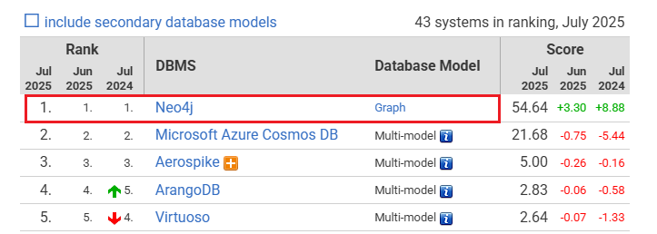
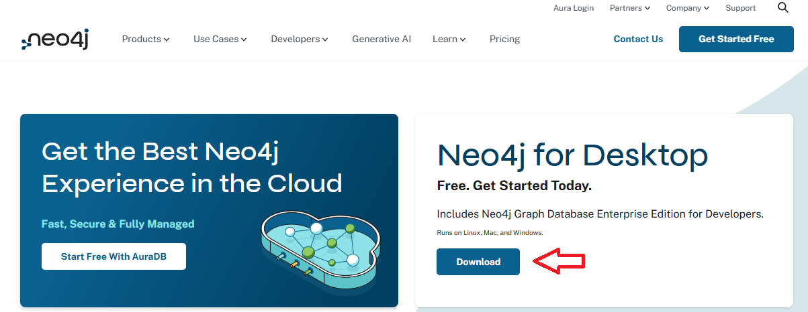
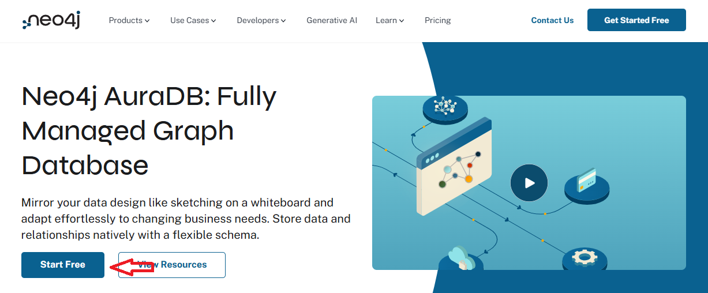
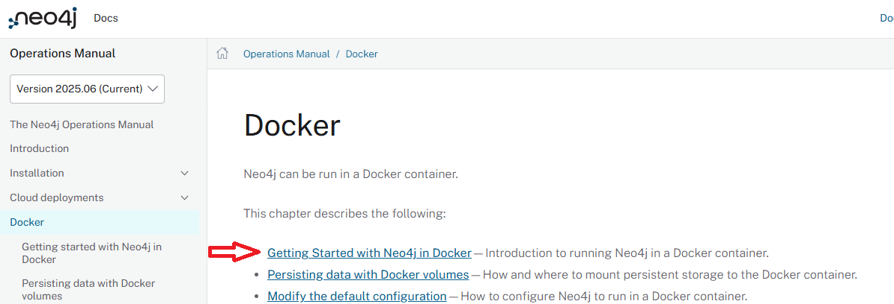

# [1. Neo4j란?](https://neo4j.com/)
**Neo4j는 노드(Node), 관계(Relationship), 속성(Properties)** 을 기반으로 하는 **속성 그래프 모델(Property Graph Model)** 을 사용하는 그래프 DBMS입니다.

---
## 특징 및 장점

| 요소                    | 설명                                        |
| --------------------- | ----------------------------------------- |
| **노드 (Node)**         | 하나의 개체 (예: 사람, 제품, 기술 등)                  |
| **관계 (Relationship)** | 두 노드 간의 관계 (예: 친구이다, 구매했다, 사용한다 등)        |
| **속성 (Property)**     | 노드나 관계가 갖는 키-값 쌍의 데이터 (예: 이름, 나이 등)       |
| **레이블 (Label)**       | 노드의 분류 (예: `:Person`, `:Company`)         |
| **타입 (Type)**         | 관계의 분류 (예: `[:FRIEND_OF]`, `[:WORKS_AT]`) |

---
## 활용 분야 

| 분야          | 활용 예                         |
| ----------- | ---------------------------- |
| 지식 그래프   | 문서, 논문, 보고서에서 개체 추출 → 관계 연결  |
| 소셜 네트워크  | 사람 간 친구 관계, 팔로우, 그룹 구조       |
| 추천 시스템   | 고객 → 제품 → 리뷰 → 태그 관계 분석      |
| 사기 탐지    | 금융 거래 간 연결 탐지                |
| GraphRAG | LLM과 연결하여 의미 기반 질의 응답 시스템 구축 |

---
## [Graph Database 순위](https://db-engines.com/en/ranking/graph+dbms) 
- Neo4j는 Graph Database들 중에서 가장 인기가 많습니다.



---
# 2. Neo4j 설치방법 

---
## [2-1. Neo4j Desktop 설치](https://neo4j.com/download/)
- 가장 간편하게 사용할 수 있는 방식입니다. 



---
### 설치 방법
- [공식 다운로드 사이트 접속](https://neo4j.com/download/)
- "Neo4j Desktop" 선택 후 다운로드
- 설치 파일 실행 → 계정 생성 또는 로그인 (무료)
- "New Project" 생성 후, DB 인스턴스 생성 및 실행

### 장점
- GUI 지원
- 여러 프로젝트 관리 가능
- Cypher 코드 에디터 제공
- Neo4j Bloom 시각화도 설치 가능

---
## [2-2. Neo4j Aura 사용 (클라우드, 설치 없이)](https://neo4j.com/product/auradb/)
- Neo4j가 제공하는 클라우드 기반 그래프 DB 서비스입니다. 



---
### 사용 방법
- https://neo4j.com/aura 접속
- 무료 계정 생성
- "Create Database" 클릭
- 접속 URL과 비밀번호 확인 후, Neo4j Browser 또는 코드에서 접속

### 장점
- 설치 불필요
- 클라우드에서 언제 어디서나 접근 가능
- 팀 협업/시연용으로 좋음

---
## [2-3. Docker로 설치](https://neo4j.com/docs/operations-manual/current/docker/)
- Docker를 설치한 상태라면 터미널 한 줄로 실행 가능하고, 가장 빠른 설치 방법입니다.



---
### 실행 명령어
- 웹 브라우저에서 http://localhost:7474 접속
- 사용자명: neo4j, 비밀번호: test1234
```shell
# 윈도우용 
docker run `
    --restart always `
    --publish=7474:7474 --publish=7687:7687 `
    --env NEO4J_AUTH=neo4j/test1234 `
    neo4j:2025.06.0
```
### 장점 
- 빠르고 간편
- 테스트 및 개발용으로 최적

