# [Cypher란?](https://neo4j.com/docs/cypher/)
- Cypher는 Neo4j에서 노드, 관계, 속성 등을 생성하고 탐색할 수 있도록 설계된 선언적(declarative) 그래프 쿼리 언어입니다.
- 사람이 읽고 쓰기 쉬운 문법으로 되어 있어서, 복잡한 그래프 쿼리도 직관적으로 표현할 수 있는 것이 큰 장점입니다.

---
## 기본 개념 요약

| 개념                    | 설명            | 예시                        |
| --------------------- | ------------- | ------------------------- |
| **노드 (Node)**         | 개체 (사람, 기술 등) | `(p:Person {name: "경원"})` |
| **관계 (Relationship)** | 노드 간의 연결      | `[:KNOWS]`, `[:WORKS_AT]` |
| **속성 (Property)**     | 노드/관계의 정보     | `{name: "윤서", age: 30}`   |
| **패턴 (Pattern)**      | 노드와 관계의 구조 표현 | `(a)-[:MARRIED_TO]->(b)`  |

---
## 자주 쓰는 Cypher 키워드

| 키워드      | 기능                      |
| -------- | ----------------------- |
| `CREATE` | 노드 또는 관계 생성             |
| `MATCH`  | 특정 패턴과 일치하는 그래프 요소 찾기   |
| `RETURN` | 결과 반환                   |
| `WHERE`  | 조건 필터링                  |
| `MERGE`  | 있으면 유지, 없으면 생성 (UPSERT) |
| `SET`    | 속성 추가/수정                |
| `DELETE` | 노드 또는 관계 삭제             |

---
## Neo4j 생성

---
### 1. 단계: Docker desktop 실행 
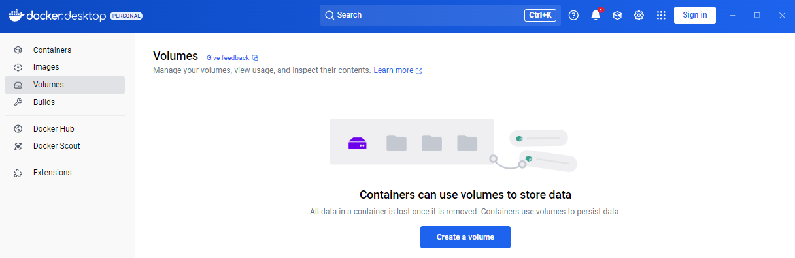

---
### 2. 단계: Neo4j Docker 생성 및 실행 
```shell
# 윈도우용 
docker run -d `
    --restart always `
    --publish=7474:7474 --publish=7687:7687 `
    --env NEO4J_AUTH=neo4j/test1234 `
    neo4j:2025.06.0
```
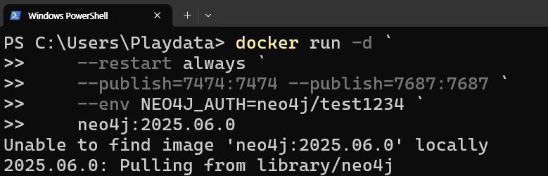

---
### 3. 단계: Neo4j 접속 
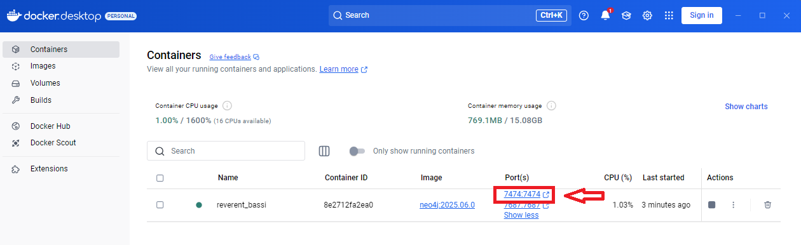

---
- 접속 url: http://localhost:7474
- database user: neo4j
- password: test1234
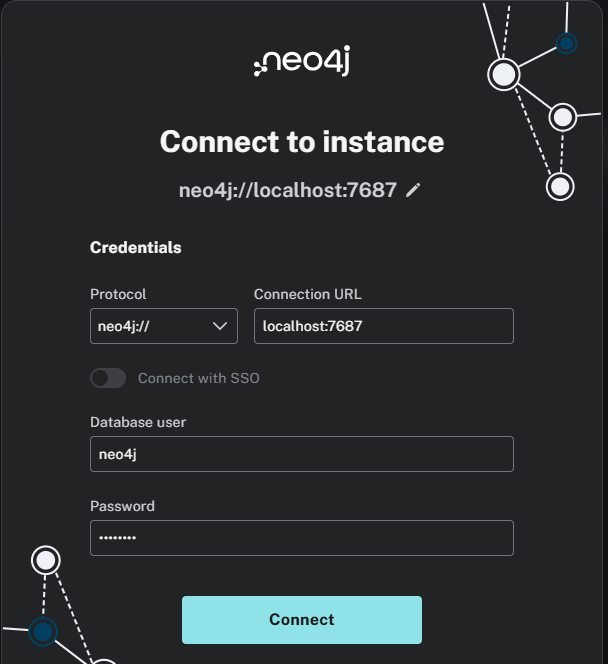

---
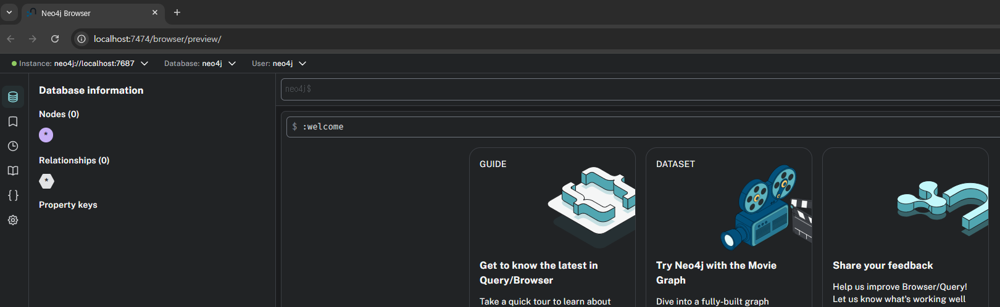

---
## Cypher 쿼리 예제
### 노드 생성
```cypher
CREATE (:Person {name: '홍길동', job: 'AI강사'})
```
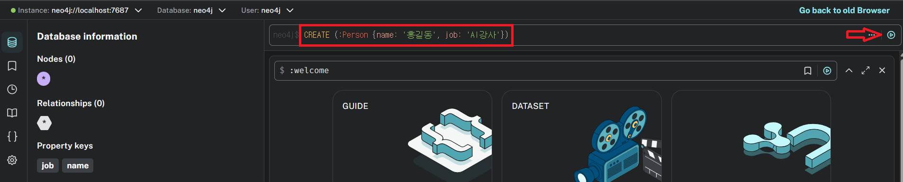

---
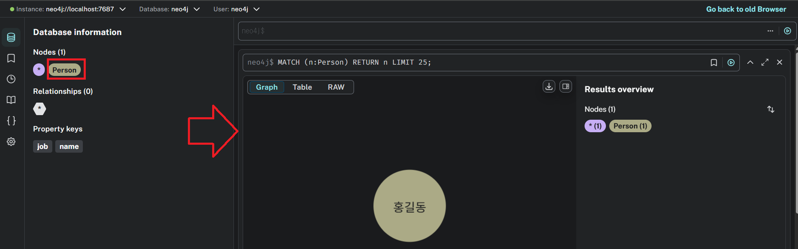

---
### 관계 생성
```cypher
CREATE (:Person {name: '신사임당', job: '웹개발강사'})
```
```cypher
MATCH (a:Person {name: '홍길동'}), (b:Person {name: '신사임당'})
CREATE (a)-[:MARRIED_TO]->(b)
```
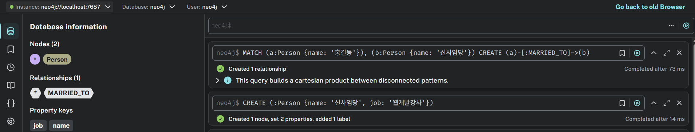

---
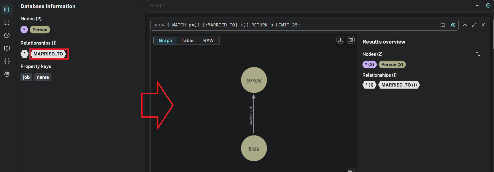

---
### 관계 기반 조회
```cypher
MATCH (a:Person)-[:MARRIED_TO]->(b:Person)
RETURN a.name, b.name

```
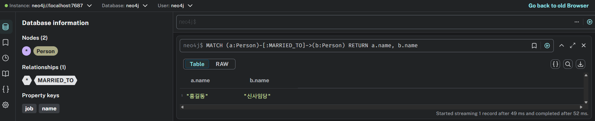

---
### 조건 검색
```cypher
MATCH (p:Person)
WHERE p.name = '신사임당'
RETURN p
```
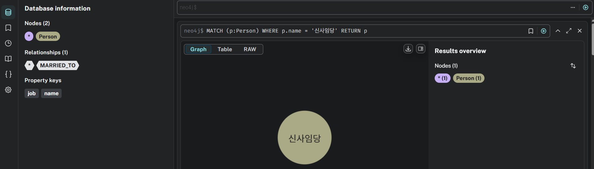

---
### 연결된 경로 검색
```cypher
MATCH path = (p1:Person)-[*1..3]-(p2:Person)
WHERE p1.name = '홍길동'
RETURN path
```
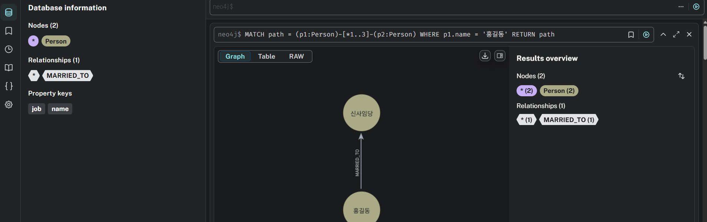

---
### 데이터 삭제
```cypher
MATCH (p:Person {name: '홍길동'})
DETACH DELETE p

```
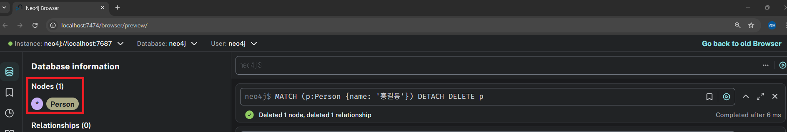
