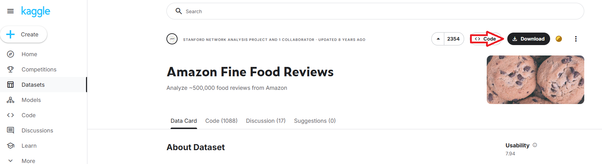

# 데이터셋 준비

---
### [다운로드](https://www.kaggle.com/datasets/snap/amazon-fine-food-reviews/data)

---
### Reviews.csv 설명 
사용자들이 매긴 리뷰 각각을 식별하는 ID와 함께 데이터를 확인할 수 있습니다.
- 상품의 Id (ProductId)
- 사용자 Id (UserId)
- 사용자 프로필이름 (ProfileName)
- 리뷰가 도움이 된 사람들의 수 (HelpfulnessNumerator)
- 리뷰가 도움이 되었는지에 대한 답변을 한 사람들의 수 (HelpfulnessDenominator)
- 상품에 대한 1점~5점 사이의 점수 (Score)
- 리뷰를 등록한 시점 (Time)
- 리뷰 요약 (Summary)
- 리뷰 텍스트 (Text)

---

