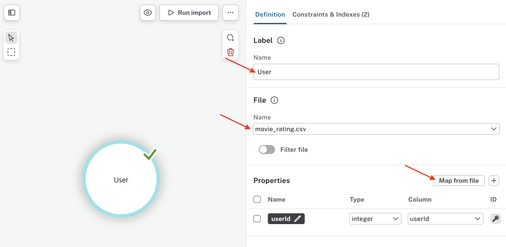
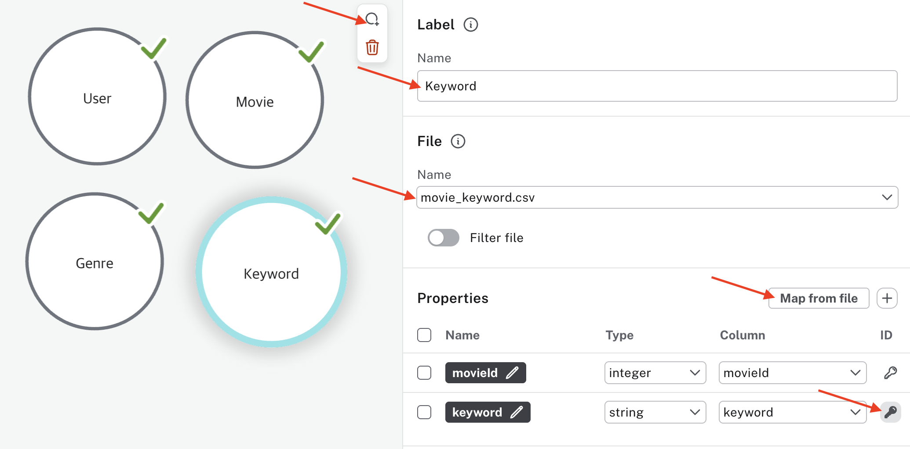
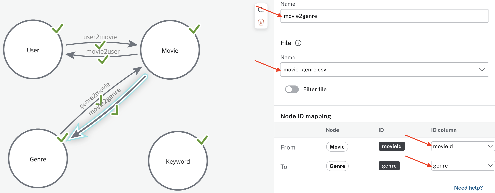
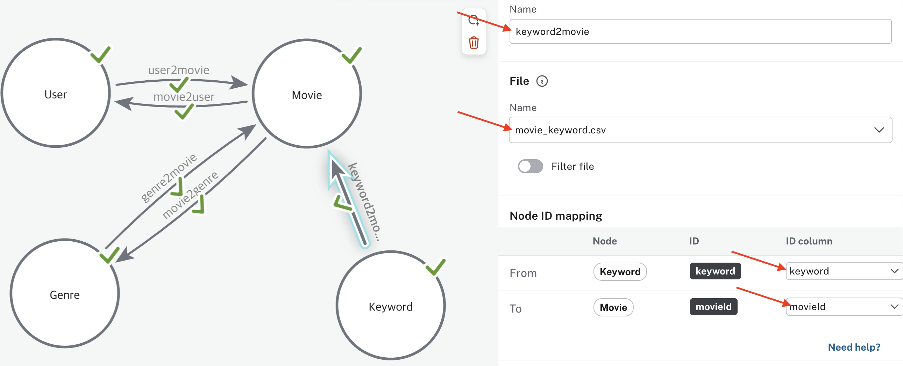
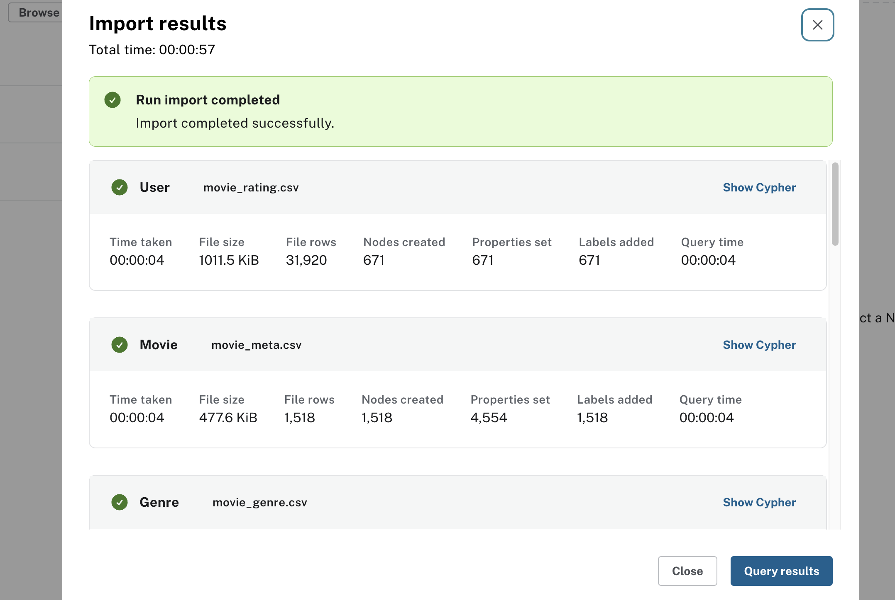

# Neo4j Sandbox 구축

---
### [단계1: Neo4j Sandbox 접속](https://sandbox.neo4j.com) 

---
### 단계2: Create

---
### 단계3: Connection details(접속 정보)

---
### 단계4: Connect via drivers(파이썬 접속 방법)

---
### 단계5: Open

---

---
- 저장된 데이터 없음: No Nodes & No Edge

---
# 데이터셋 임포트

---
### [단계1: data-importer 접속](https://data-importer.neo4j.io/)
- 생성된 DB의 접속 정보 사용

---
### 단계2: 파일 업로드 

---
# Node 정의

---
### 단계1: User

---
### 단계2: Movie

---
### 단계3: Genre

---
### 단계4: Keyword

---
# Edge 정의

---
### 단계1: user2movie

---
### 단계2: movie2user

---
### 단계3: genre2movie

---
### 단계4: movie2genre

---
### 단계5: keyword2movie

---
### 단계6: movie2keyword

---
# Nodes & Edges 적용

---
### 단계1: Run import

---

---

---
### 단계2: 확인 on Neo4j Sandbox

---
### 단계3: Node 확인 

---
### 단계4: Edge 확인

