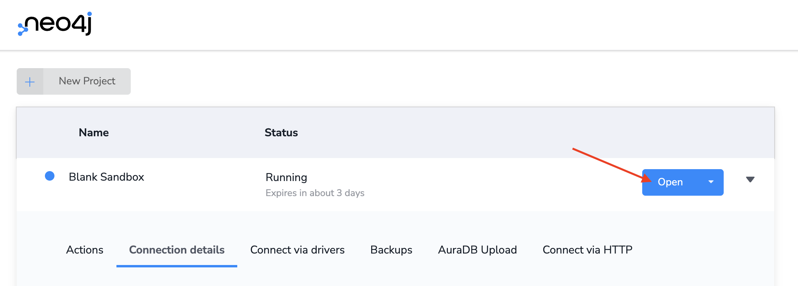
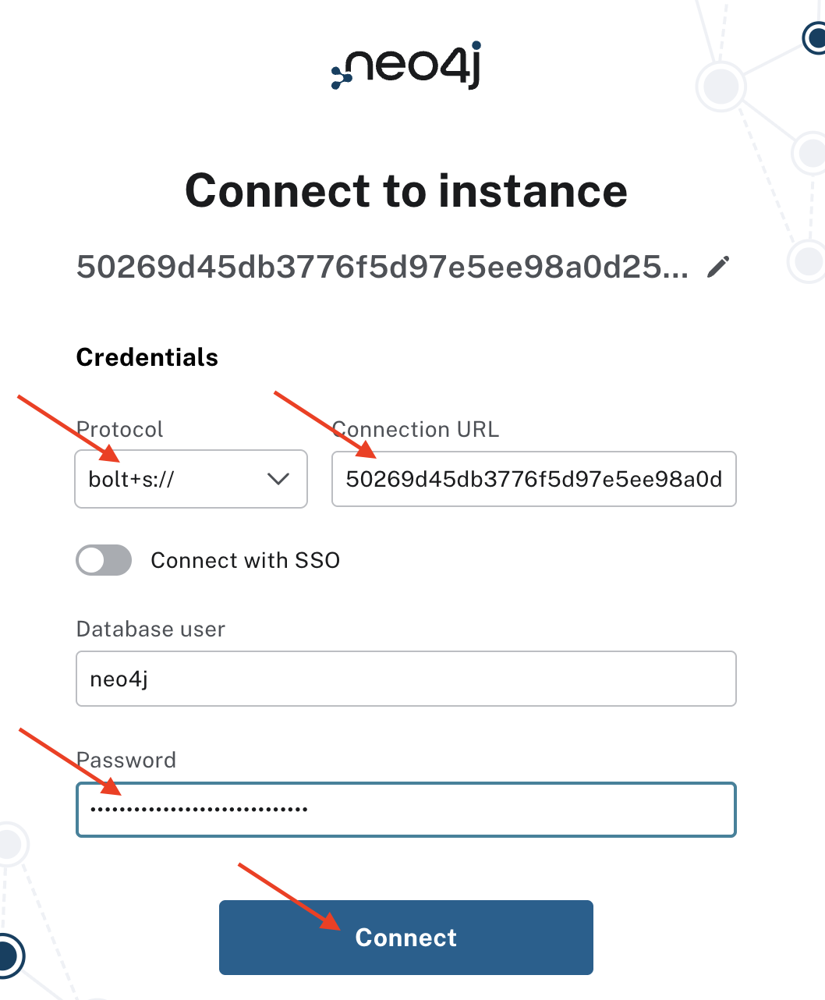
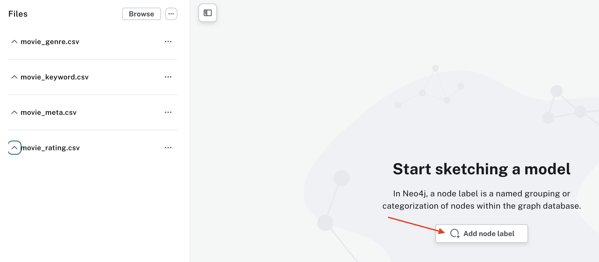
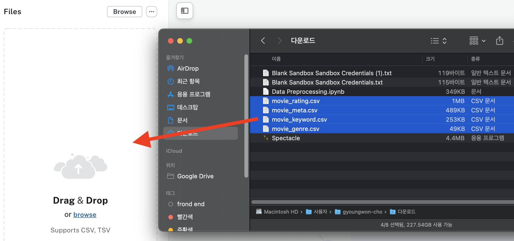

# Neo4j Sandbox 구축

---
### [단계1: Neo4j Sandbox 접속](https://sandbox.neo4j.com) 


---
### 단계2: New Project


---


---
### 단계3: 생성된 DB의 접속 정보 확인 


---
# 데이터셋 임포트

---
### [단계1: data-importer 접속](https://data-importer.neo4j.io/)
- 생성된 DB의 접속 정보 사용


---
### 단계2: 파일 업로드 


---
### 단계3: movieId 노드 생성


---
### 단계4: rating 노드 생성


---
### 단계5: userId 노드 생성


---
### 단계6: genre 노드 생성


---
### 단계7: keyword 노드 생성


---
# 관계성 생성

---
### 단계1: Neo4j Sandbox 접속 


---
### 단계2: Nodes 확인


---
### 단계3: RATED 생성
```cypher
MATCH (r:rating), (u:userId {userId: r.userId}), (m:movieId {movieId: r.movieId})
MERGE (u)-[:RATED {score: r.rating}]->(m)
```


---
```cypher
MATCH p=()-[r:RATED]->() RETURN p LIMIT 25
```


---
### 단계4: HAS_GENRE 생성
```cypher
MATCH (m:movieId), (g:genre)
WHERE m.movieId = g.movieId
MERGE (m)-[:HAS_GENRE]->(g)
```


---
```cypher
MATCH p=()-[r:HAS_GENRE]->() RETURN p LIMIT 25
```


---
### 단계5: HAS_KEYWORD 생성
```cypher
MATCH (m:movieId), (k:keyword)
WHERE m.movieId = k.movieId
MERGE (m)-[:HAS_KEYWORD]->(k)
```


---
```cypher
MATCH p=()-[r:HAS_KEYWORD]->() RETURN p LIMIT 25
```


