# [Model Context Protocol (MCP)란?](https://norahsakal.com/blog/mcp-vs-api-model-context-protocol-explained/)
- MCP(Model Context Protocol)는 애플리케이션이 대규모 언어 모델(LLM)에 컨텍스트를 제공하는 방식을 표준화하도록 설계된 새로운 개방형 프로토콜입니다.
- MCP는 AI 에이전트를 위한 USB-C 포트라고 생각하면 됩니다. MCP는 AI 시스템을 다양한 도구와 데이터 소스에 연결하는 균일한 방법을 제공합니다.

---
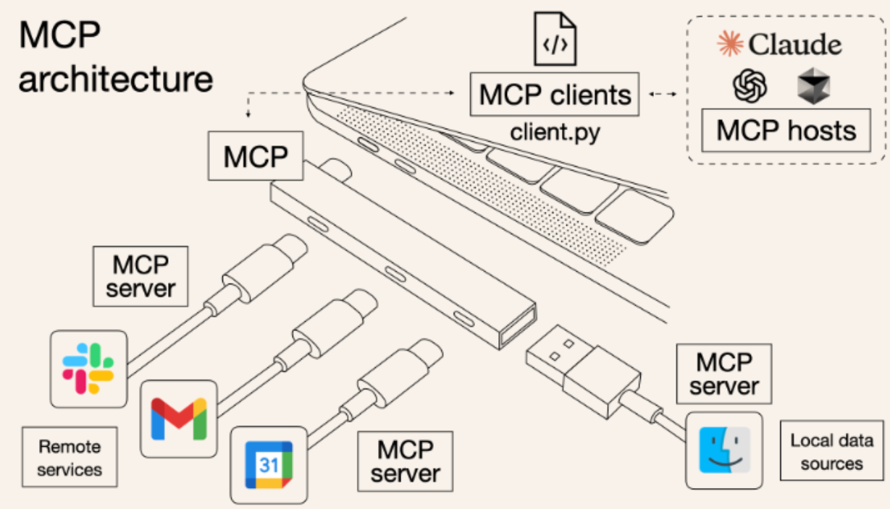

---
## 기존 API
- 비유적으로 말해서 API는 개별 문서와 같습니다.
- 기존 API는 개발자가 각 서비스 또는 데이터 소스에 대한 사용자 정의 통합을 작성해야 합니다.

---
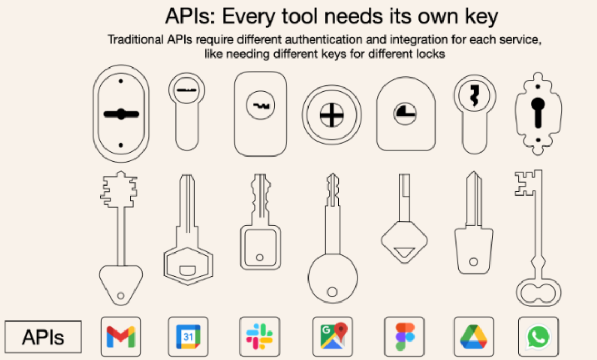

---
## MCP vs API
- 단일 프로토콜: `MCP`는 표준화된 "커넥터" 역할을 하므로 하나의 `MCP`를 통합하면 하나가 아닌 여러 도구와 서비스에 잠재적으로 액세스할 수 있습니다.
- 동적 검색: `MCP`를 사용하면 AI 모델이 각 통합에 대한 하드코딩된 지식 없이도 사용 가능한 도구를 동적으로 검색하고 상호 작용할 수 있습니다.
- 양방향 통신: `MCP`는 WebSockets와 유사한 지속적이고 실시간 양방향 통신을 지원합니다. AI 모델은 정보를 검색하고 동적으로 동작을 트리거할 수 있습니다.

---
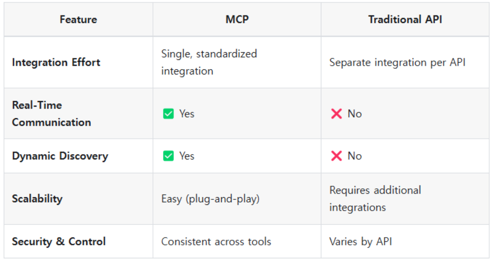

---
## [MCP 작동 방식](https://modelcontextprotocol.io/introduction)
- `MCP 호스트` : MCP를 통해 데이터에 액세스하려는 Claude Desktop, IDE 또는 AI 도구와 같은 프로그램
- `MCP 클라이언트` : 서버와 1:1 연결을 유지하는 프로토콜 클라이언트
- `MCP 서버` : 표준화된 모델 컨텍스트 프로토콜을 통해 각각 특정 기능을 노출하는 경량 프로그램
- `로컬 데이터 소스` : MCP 서버가 안전하게 액세스할 수 있는 컴퓨터의 파일, 데이터베이스 및 서비스
- `원격 서비스` : MCP 서버가 연결할 수 있는 인터넷(예: API를 통한)을 통해 사용 가능한 외부 시스템

---
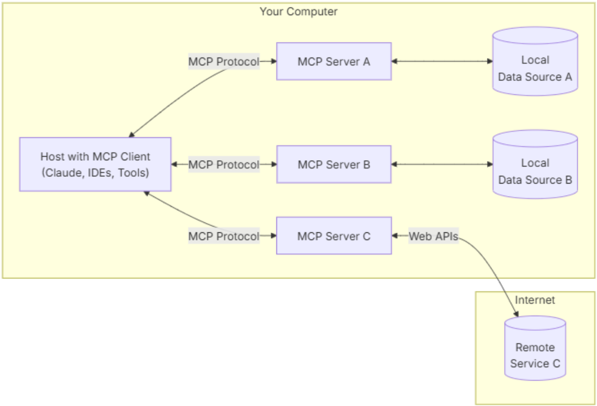

---
## MCP 마켓
### [Smithery.ai](https://smithery.ai/)
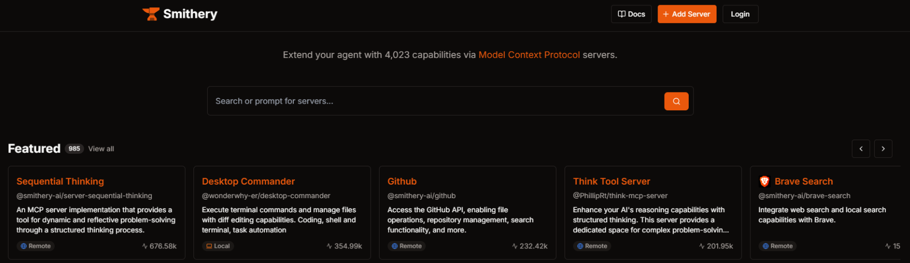

---
### [MCP Servers](https://mcp.so/)
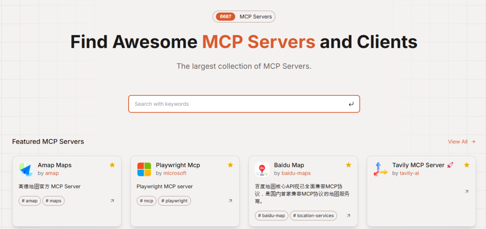

---
### [NPM - MCP Search](https://www.npmjs.com/search?q=mcp)
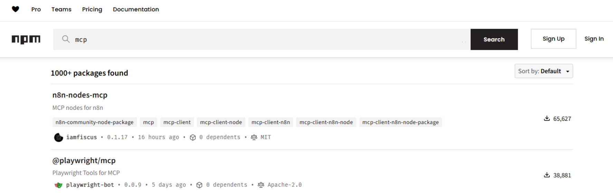

---
# [예제 - Claude 데스크톱](https://www.youtube.com/watch?v=jpWtV08fF-E&t=123s)

---
## [NPM](https://velog.io/@lafefish/NPM%EC%9D%B4%EB%9E%80%EC%9A%A9%EC%96%B4%EB%B0%8F-%EA%B8%B0%EB%B3%B8-%ED%98%95%ED%83%9C)
- npm은 node(node.js) package manager의 약자 입니다. 이름에서 볼 수 있는 것과 같이 원래는 node.js의 패키지(독립된 모듈)을 개발하고, 배포, 공유하기 위한 관리 툴이라고 볼 수 있습니다.
- npm은 현재 npm package자체를 이야기하는 단어로도 사용되고, node package manager라는 용어로도 사용 됩니다.

이름이 말해주는 것과 같이 당연히 node.js 환경위에서 동작 합니다.

---
### [1. NPM 설치](https://nodejs.org/en/download)
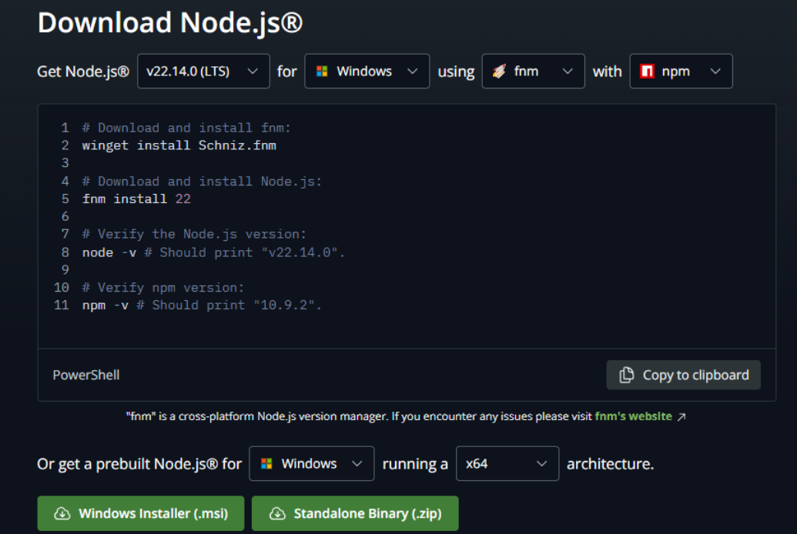

---
## [Claude 소개](https://docs.anthropic.com/ko/docs/intro-to-claude)
- Claude는 Anthropic이 개발한 고성능 및 지능형 AI 모델 제품군입니다.
- Claude는 강력하고 확장 가능하면서도 가장 신뢰할 수 있고 안정적인 AI입니다.
- 중요한 프로토콜을 따르고, 실수가 적으며, 잠금해제 시도에 강한 내성을 가지고 있어 기업 고객이 대규모로 가장 안전한 AI 기반 애플리케이션을 구축할 수 있습니다.

---
### [2. Claude 데스크톱 설치](https://claude.ai/download)
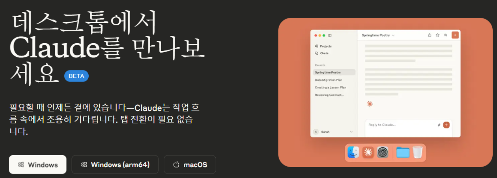

---
## 3. MCP 추가
### [mcp-image-reader](https://www.npmjs.com/package/mcp-image-reader)
- ImageReader는 이미지 파일을 읽고 이를 AI 모델을 위한 Base64 인코딩 데이터로 변환하는 Model Context Protocol(MCP) 서버입니다.
- 이 도구를 사용하면 AI 모델이 로컬 파일 시스템의 이미지를 분석하고 처리할 수 있습니다.

---
아래 부분 복사
```json
{
    "mcpServers": {
        "image_reader": {
            "command": "npx",
            "args": [
                "-y",
                "mcp-image-reader"
            ]
        }
    }
}
```

---
## 4. Claude에 적용
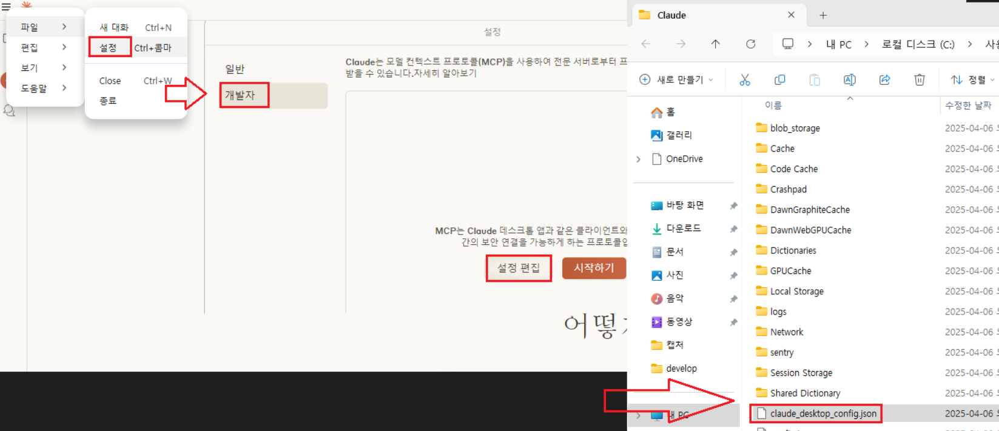

---


---
## 5. Claude 종료
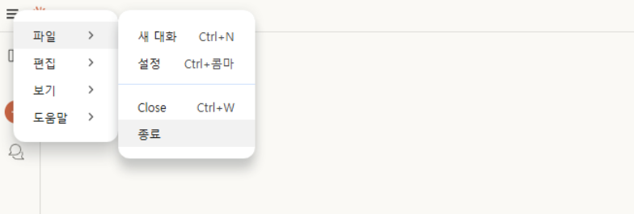

---
## 6. Claude 재실행 & read_image 확인
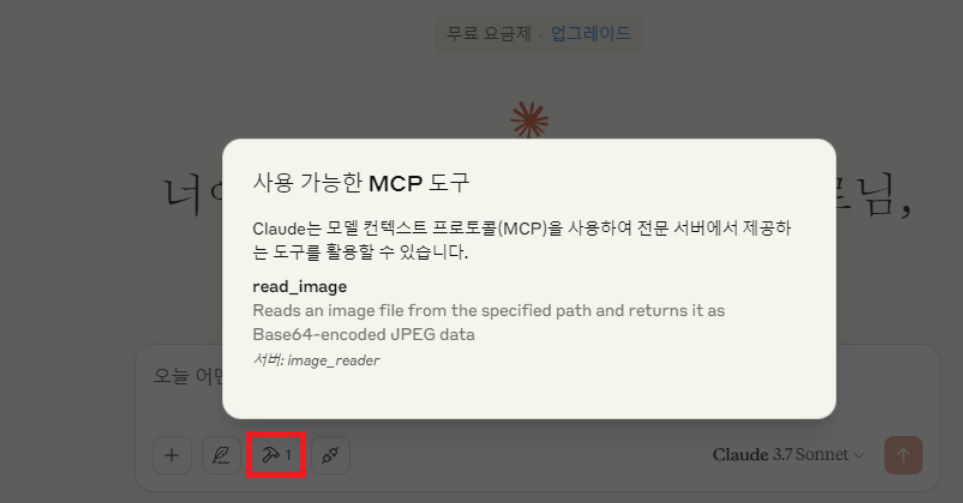

---
## 7. 사용해보기
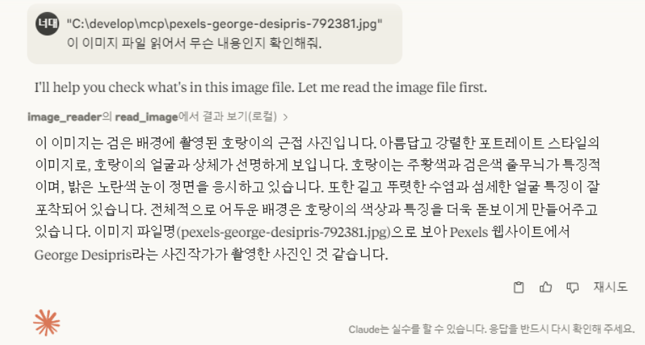

---
# [예제 - Cursor](https://www.youtube.com/watch?v=t5Tj5_2uyTs)

---
## [1. Cursor 설치](https://www.cursor.com/)
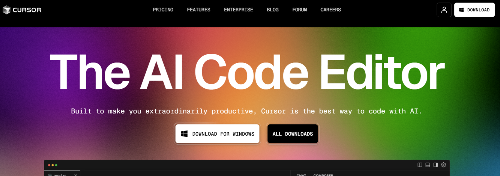

---
## [2. Tavily Key 발급](https://app.tavily.com/sign-in)
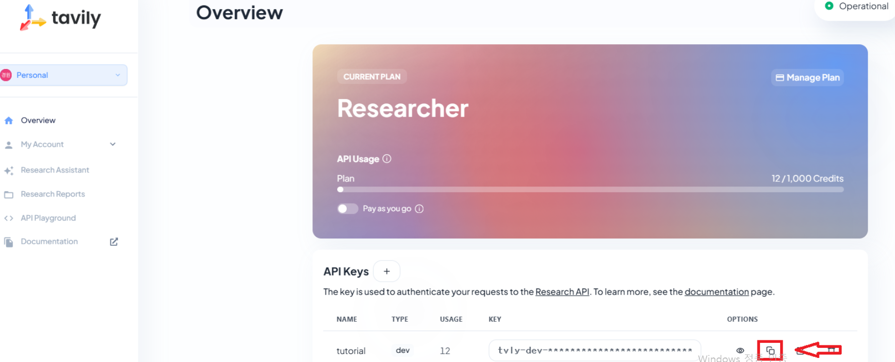

---
## [3. Tavily MCP](https://smithery.ai/)
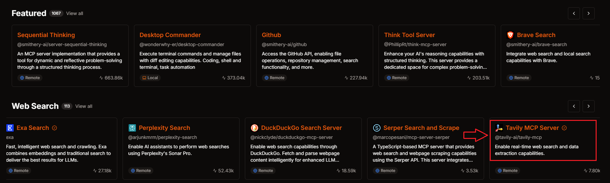

---
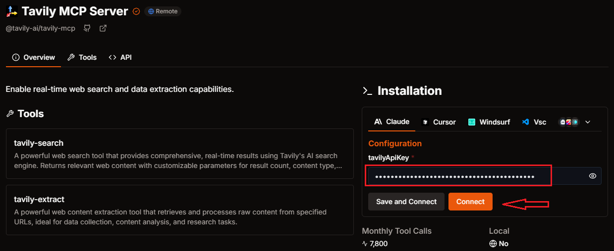

---
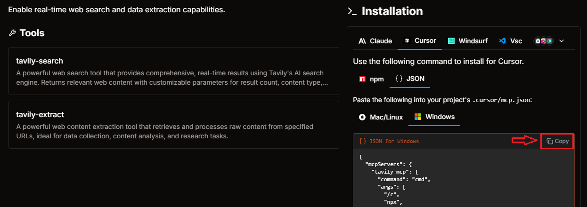

---
## 4. Cursor에 적용
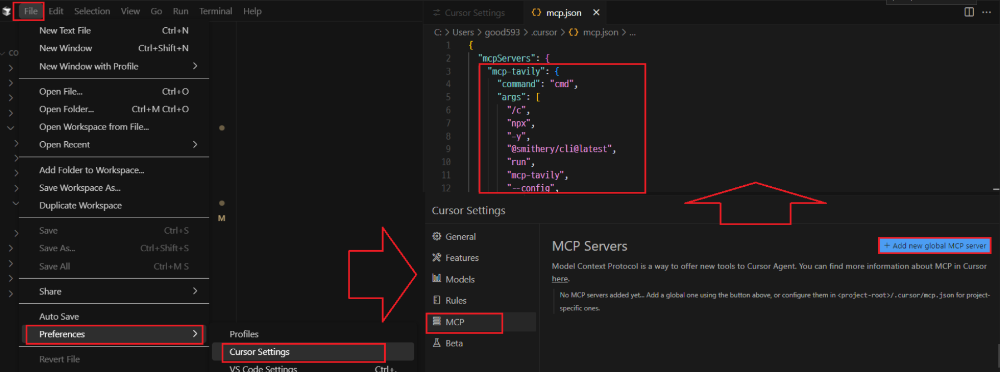

---
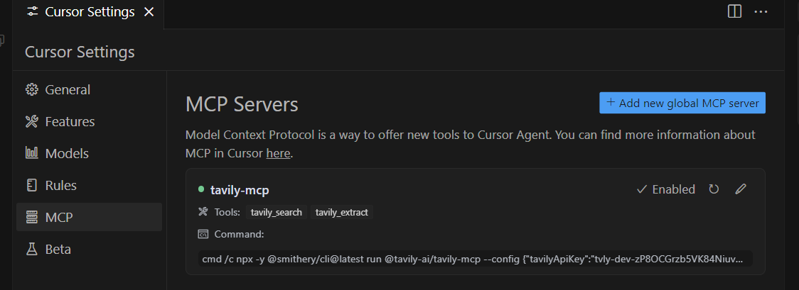

---
## 5. 테스트
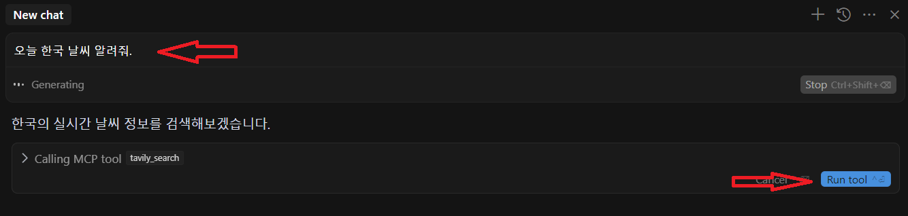

---
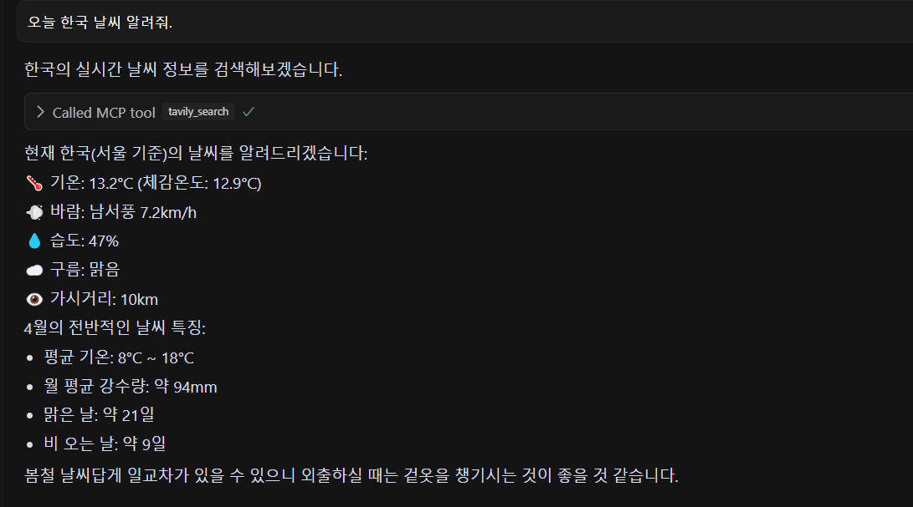


