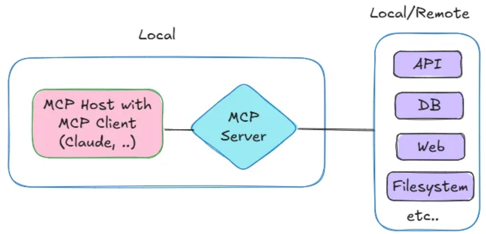
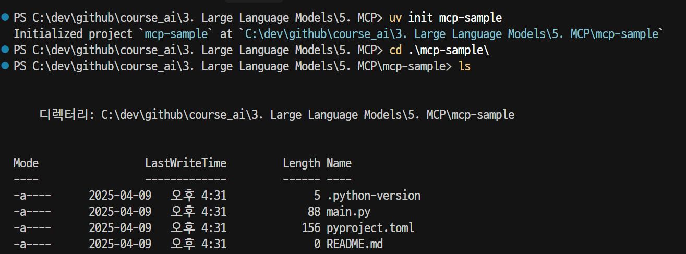
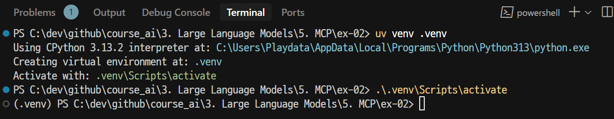
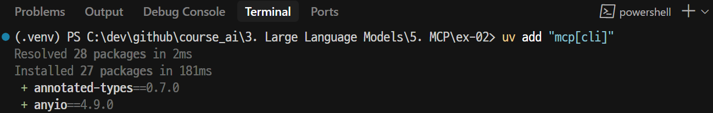
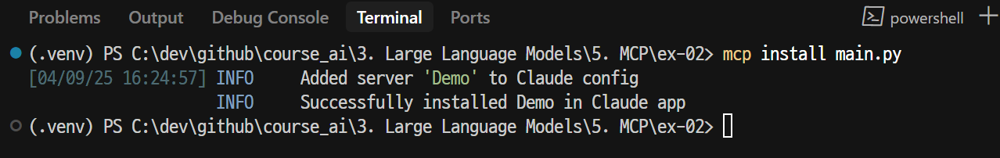
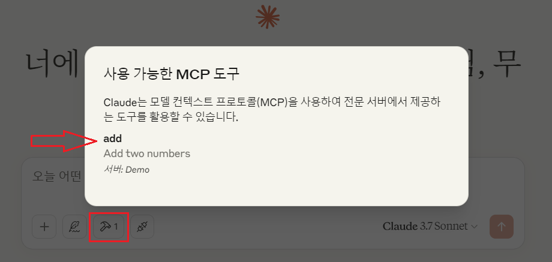
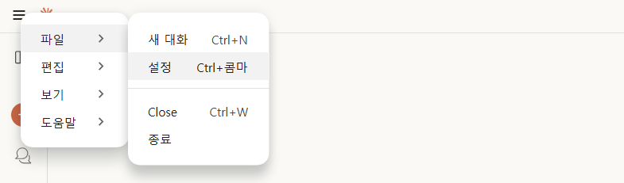
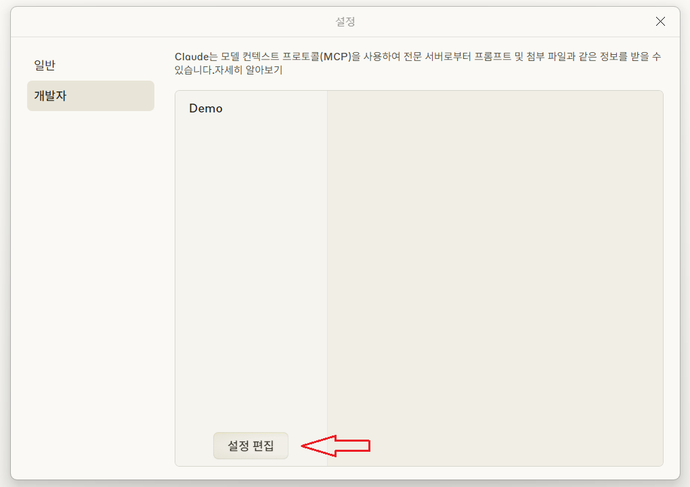
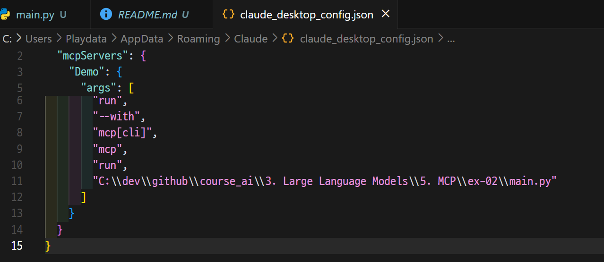
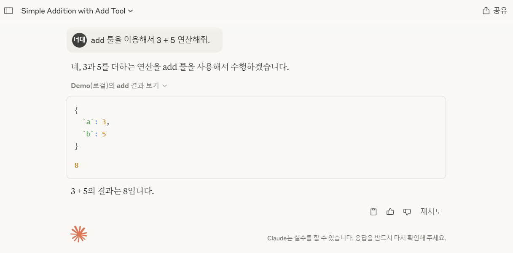

# MCP Server
- MCP 서버는 LLM이 사용할 수 있는 도구와 데이터 액세스 기능을 제공하는 프로그램



---
## Setup

---
### 단계1: 프로젝트 생성 
```shell
uv init <프로젝트명> 
cd <프로젝트명>
```


---
### 단계2: 가상환경 생성  
```shell
uv venv .venv 
.venv/Scripts/activate
```


---
### 단계3: 관련 라이브러리 추가 
```shell
uv add "mcp[cli]"
```


---
## MCP Servier > main.py
```python
# server.py
from mcp.server.fastmcp import FastMCP

# Create an MCP server
mcp = FastMCP("Demo")


# Add an addition tool
@mcp.tool()
def add(a: int, b: int) -> int:
    """Add two numbers"""
    return a + b

```

---
## Claude Desktop에 적용
- 사전작업 
  - [Claude Desktop 설치](https://claude.ai/download)

---
### 단계1: MCP Server 적용 
```shell
mcp install main.py
```


---


---
### 단계2: Claude Desktop의 config.json 확인 


---


---


---
### 단계3: add 툴 사용하기 


---


---
# 참고문서
- https://github.com/modelcontextprotocol/python-sdk


