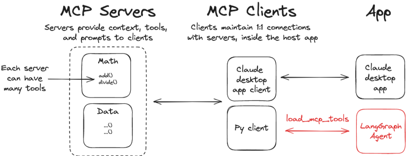
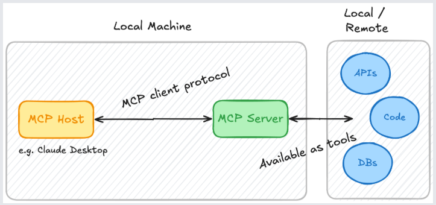
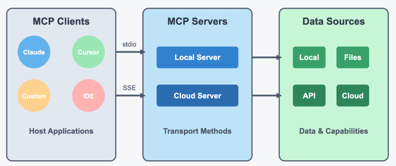
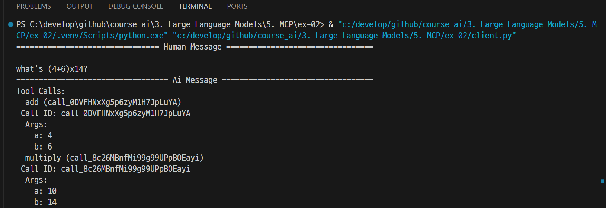

# LangChain MCP Adapters



---
### Setup
- `.env.example`을 참고해서 `.env` 파일 생성
- 가상환경 생성 및 접속 
```shell
uv venv .venv 
.\.venv\Scripts\activate
```
- 가상환경 생성 및 접속 
```shell
uv pip install -r requirements.txt
```

---
### MCP Server
- `math_server.py`
- MCP 서버는 LLM이 사용할 수 있는 도구와 데이터 액세스 기능을 제공하는 프로그램입니다. 



---
### MCP Client
- `client.py`
- MCP 클라이언트는 MCP 서버를 연결하는 브리지입니다.



---
# 실행 
- MCP Clinet 실행 및 결과 확인 


---
# 참고문서
- https://www.youtube.com/watch?v=RjalY4oRPtc


